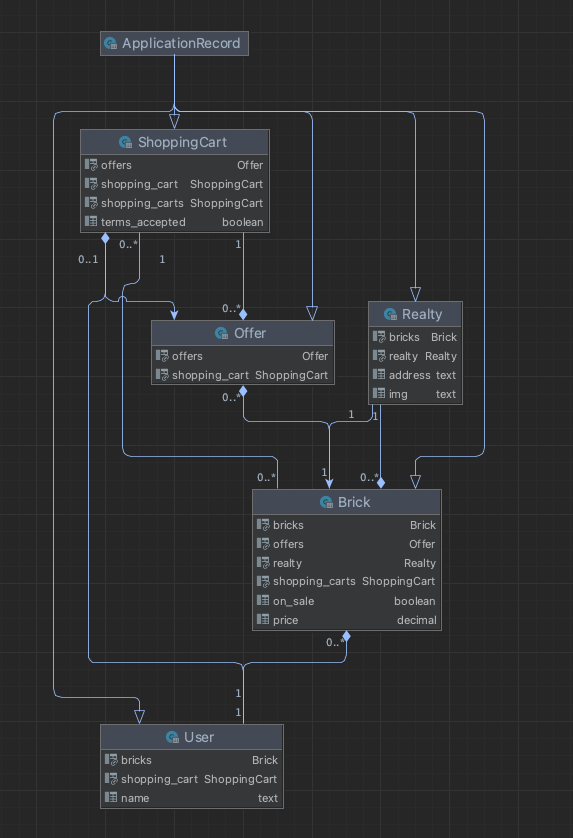

# ninety-nine-bricks

tldr
---

A simple, self-contained brick marketplace for diversified investment.

requirements
---

`ruby >= 3`
`rails >= 7`
`Postgresql >= 14`

setup
---

nothing out of the ordinary here - 
`bundle install` to install dependencies
`rspec` to run tests

optional but **recommended** run initial seed
`rake devcam:build_demo` to seed database (it creates an interesting use-case)

`rails db:create, migrate and all that jazz`
`rails s`

interesting urls
---

|                    url                     |                               description                                |
|:------------------------------------------:|:------------------------------------------------------------------------:|
|      `http://localhost:3000/realties`      |                           list of all realties                           |
|       `http://localhost:3000/offers`       | primitive ui to add and remove bricks to carts (must be done trough ids) |
|       `http://localhost:3000/users`        |                       primitive ui to handle users                       |
|  `http://localhost:3000/shopping_carts/`   |                       primitive ui to handle users                       |

notable resources
---

note the noncomprehensive list of available resources. if using a foreign (i.e not `rails`) client, it is required to
suffix each request with `.json` - i.e `http://localhost:3000/offers.json`

|             resource.json              | description |                 Notes                 |
|:--------------------------------------:|:-----------:|:-------------------------------------:|
|                `users/`                |  GET, POST  |     gets all users, creates users     |
|              `users/:id`               |     GET     |  get user details (includes bricks)   |
|               `offers/`                |  GET, POST  |    gets all offers, creates offers    |
|              `offers/:id`              |     GET     |           get offer details           |
|           `shopping_carts/`            |     GET     |  get all shopping carts (no bricks)   |
|          `shopping_carts/:id`          |     GET     | get shopping_cart details (w/ bricks) |
|   `shopping_carts/:id/accept_terms`    |     GET     |     accept terms for transaction      |
| `shopping_carts/:id/complete_purchase` |     GET     | completes the purchase (if possible)  |

notable implementation details
---

transactions are atomic. an arbitrary ammout of users can have offers on a single brick, the resolution is:
**first come, first served** and critical `error` when completition is not possible.

if a user has a bad brick in its cart, when trying to complete the purchase an error will specify the conflicting brick (i.e)

```json
{
    "bricks": [
        {
            "error": "brick is no longer available",
            "brick": 491
        }
    ]
}
```

note that NO transaction will be commited, even previously successfull brick offers will be ROLLED BACK.
also, not all bricks are checked (although it is possible), eagerly failing was preferred.

This is a conscientious decision! the logic behind it is that a user might want to change its whole investment strategy on a single bad brick.

In adition to this, I'd find unacceptable that the transaction performed is **NOT** the transaction accepted. Since its an all-or-nothing deal, **NO** changes are made
until the user fixes the conflict.

for the `diagram` oriented:




tldr
---

* A `realty` has many bricks
* A `brick` belongs to a `User`
* A `User` owns many `bricks`
* A `User` owns **one** `shopping_cart`
* A `brick` can belong to many `shopping_carts` and many `shopping_carts` can have the same brick (trought the `Offer` table)

things I wish I implemented better
---

* better U.I to add bricks from realties to shopping carts
* better U.I to display shopping_carts (add filters?)
* lock transactions such that at a certain stage, offers could not be edited (*i.e at review*).
* General error checking outside happy path ( getting bad users, bad carts, bad realties etc)
* should bricks ALWAYS have an owner? what happens to freshly minted bricks? owned by 'trust' user?
* should a realty allow for additional bricks? bricks is not a resource because it was decided leave it static.
* better `shopping_cart` validation! clients should be able to check for `errors` **before** trying to complete the purchase.
